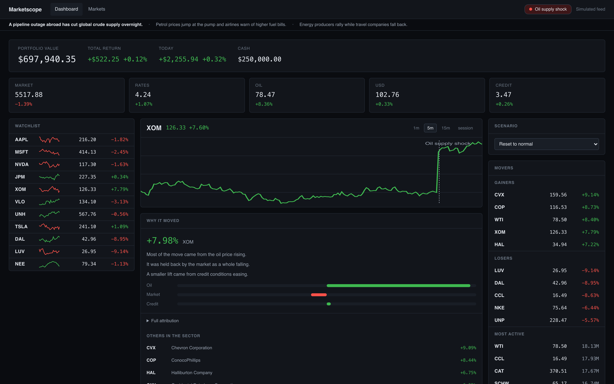
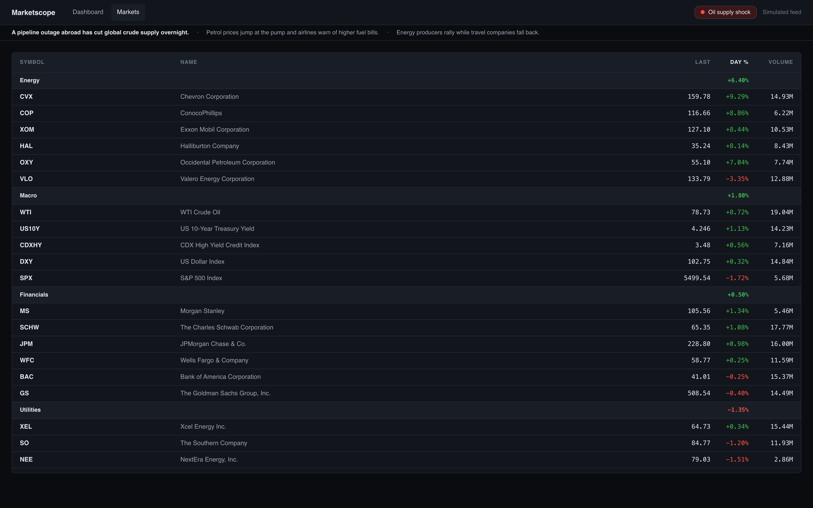
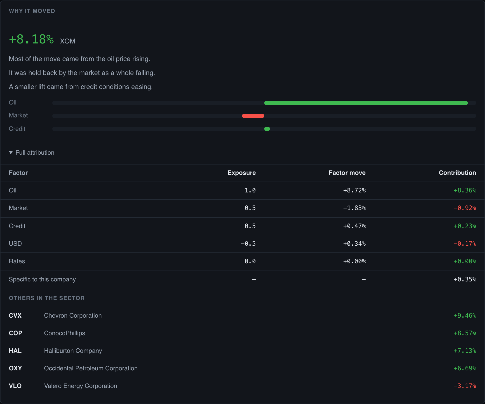

# Marketscope — a factor-driven market simulation

A trader-facing dashboard showing synthetic price fluctuations across a fixed instrument
universe, where selecting a world event from a dropdown **visibly and causally** changes the
data. It exists to demonstrate a factor model to a non-technical audience in a single view.

Pick *Oil supply shock* and energy producers climb while airlines fall, the movers lists
repopulate, the markets table reorders its sectors, a marker appears on the chart at the
moment of activation, and a panel explains the move in plain English.



*The dashboard mid-scenario. Energy names climb, airlines fall, the factor strip shows oil
carrying the move, and the chart marks the tick the event was activated.*

---

## Running it

Two processes. The backend serves the API and advances the simulation once a second; the
frontend is an Angular app that polls it.

```bash
# API — from backend/
uv run uvicorn app.main:app --port 8000

# UI — from frontend/
npm install && npm run gen:api && npx ng build && npx ng serve --port 4200
```

Then open <http://localhost:4200>.

`npm run gen:api` regenerates the typed client from `backend/openapi.json`, which is
committed — so the frontend builds with **no backend running**.

See [`DEPLOYMENT.md`](DEPLOYMENT.md) for the single-service deployment shape.

---

## The stack

| | |
|---|---|
| Backend | FastAPI, Pydantic, Python 3.12, managed by `uv`. No database. |
| Frontend | Angular 19, standalone components, RxJS. Hand-rolled CSS, no UI package. |
| Contract | OpenAPI 3.0.2 emitted from the app, client generated by `ng-openapi-gen`. |
| Transport | HTTP polling on one shared interval. No WebSockets. |

309 backend tests. `cd backend && uv run pytest tests/ -v`.

---

## How it works

Five factors — `market`, `rates`, `oil`, `usd`, `credit` — drive every price. Each
instrument carries a beta to each factor, drawn from {−1, −0.5, 0, +0.5, +1}. On every tick
each instrument's log return is `Σ beta·factor + σ·ε`, the price is multiplied by its
exponential, and **the per-factor contributions are stored on the bar alongside the price
they produced**.

That storage is what makes the attribution trustworthy: the impact panel does not
re-derive why a price moved, it sums what was recorded at the moment it moved. The two
reconcile to within 1e-6 by construction rather than by two calculations agreeing — measured
at 1.68e-16 across 94,185 reconciliations.

A scenario shocks the factors' *levels*. Each tick carries the change in that level, so
activation applies the whole shock, decay unwinds it gradually, and switching scenarios
unwinds the outgoing one as the incoming one lands.

The universe is built so scenarios disagree **within** a sector as well as between them —
under an oil spike a refiner gains while an airline suffers. Scattered through a flat list
that is invisible; grouped by sector with energy rising above industrials, it needs no
explanation.

---

## What it looks like

**The markets table** — every instrument grouped by sector, groups ordered by their
aggregate move. Under an oil shock energy rises to the top and the fuel-consuming sectors
sink, which is the whole reason this surface exists.



**The impact panel** — plain language first, at most three bars, and no exposure value
anywhere until the disclosure is opened. The betas live in the expanded table and nowhere
else, because the collapsed view is for someone who does not know what a beta is.



---

## Repository layout

```
app-features.md           the call notes the specifications were drawn from
backend/                  FastAPI app, simulation, 309 tests
frontend/                 Angular workspace; src/app/api/ is generated and committed
.spec-artifacts/          how this was built — see below
DEPLOYMENT.md             the deployment plan
```

---

## `.spec-artifacts/` — the part worth reading

This was built with a spec-driven agent method: a specification decomposed into tasks, one
prompt per task, dispatched to an implementor by an orchestrator that is deliberately given
**no context** beyond the artefacts on disk — so a prompt that depends on something nobody
wrote down fails visibly instead of being filled in from memory.

| | |
|---|---|
| `specs/` | two specifications — backend and frontend — 24 tasks between them |
| `prompts/` | one prompt per task |
| `design/` | the visual target, approved as a static page before any code was written |
| `decisions/` | six ADRs |
| `incidents/` | two incident records |
| `process/` | how the work was done, filed apart from decisions about the system |
| `logs/` | twelve run records from the backend build |

Plus [`docs/bug-report-2026-09-16.md`](docs/bug-report-2026-09-16.md) — two defects found by
reviewing screenshots of the running app against the outcomes the spec asserts. One fixed,
one recorded and deliberately left, with the reason.

**The honest version of how it went** is in
[`incidents/`](.spec-artifacts/incidents/). The cold gate refused four dispatches, every one
a real authoring defect — including an API contract whose fields no document specified, and
an assertion that could not fail because FastAPI installs a truthy default. It also records
what the method *missed*: the frontend was built without the gate, and two defects reached
committed code as a result.

The git history is part of the record. Each commit says why, and the spec's history shows
intent changing mid-build — which is the point, because the gap between what was asked for
and what came back is the only signal that something went wrong.
